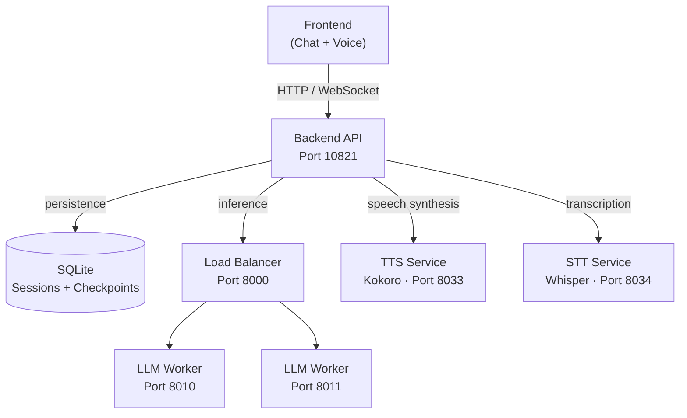
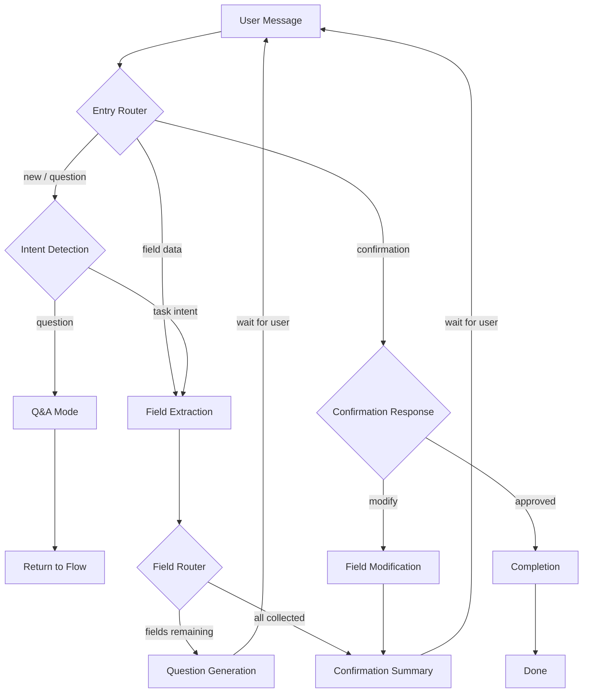

# VOLT

**Voice-Oriented LLM Toolkit** — Declarative conversational agents powered by local LLMs and LangGraph.

[](https://www.python.org/downloads/)
[](LICENSE)
[](https://github.com/langchain-ai/langgraph)
[](docker-compose.yml)
[](https://github.com/ggerganov/llama-cpp-python)
[](https://www.sqlite.org/)
[](services/tts_service/)
[](services/stt_service/)

Define agents with JSON. Run them with your own models. No API keys, no cloud dependencies.

---

## Features

- **Declarative agents** — define conversation flows with `agent.json`, no code required
- **Local LLM inference** with load balancing across multiple GGUF model instances
- **LangGraph orchestration** with explicit routing and visual debugging
- **Persistent sessions** — SQLite + LangGraph checkpointing, conversations survive restarts
- **Dual-path extraction** — regex fast-path (~0.001s) for simple inputs, LLM for complex ones
- **Voice mode** — Kokoro TTS and Whisper STT with streaming support
- **Agent factory** — generate agents from natural language via `POST /agents/create`
- **Mid-conversation Q&A** — users can ask questions without losing progress
- **Confirmation workflow** — review and modify collected data before completion

## Quick Start

### Docker

```bash
git clone https://github.com/atgugu/volt.git
cd volt
cp docker/docker.env.example .env    # configure your model path
docker compose up -d           # start all services
# Open http://localhost:10821
```

### Manual

```bash
git clone https://github.com/atgugu/volt.git
cd volt
python -m venv venv && source venv/bin/activate
pip install -r requirements.txt
cp .env.example .env           # configure your model path

# Start LLM + backend (separate terminals)
cd services/llm_inference && uvicorn main:app --host 0.0.0.0 --port 8000
python backend/app.py

# Open http://localhost:10821
```

## Architecture



## Creating an Agent

### From a prompt

```bash
curl -X POST http://localhost:10821/agents/create \
  -H "Content-Type: application/json" \
  -d '{"prompt": "An agent that collects bug reports with title, severity, and steps to reproduce"}'
```

The factory generates `agent.json`, validates it, and registers the agent immediately.

### From JSON

Create a folder in `agents/` with an `__init__.py` and `agent.json`:

```json
{
  "name": "My Agent",
  "id": "my_agent",
  "description": "Collects information through conversation",
  "greeting": "Hello! How can I help you today?",
  "persona": "helpful assistant",
  "fields": [
    {
      "name": "user_name",
      "type": "string",
      "required": true,
      "question": "What is your name?",
      "validator": "name",
      "order": 0
    }
  ],
  "completion": {
    "message": "Thanks, {user_name}! All done.",
    "action": "log"
  }
}
```

See [Creating Agents](docs/creating-agents.md) for the full schema, validators, conditional fields, and custom nodes.

## Conversation Flow



## API

<details>
<summary>All endpoints</summary>

### Conversations

| Method | Endpoint | Description |
|--------|----------|-------------|
| `POST` | `/conversation/start` | Start conversation with an agent |
| `POST` | `/conversation/message` | Send message in conversation |
| `GET` | `/conversation/{id}/status` | Get conversation status |

### History & Completions

| Method | Endpoint | Description |
|--------|----------|-------------|
| `GET` | `/conversations/{id}/history` | Full message transcript |
| `GET` | `/completions` | List all completed conversations |
| `GET` | `/completions/{id}` | Get collected data for a session |

### Agents

| Method | Endpoint | Description |
|--------|----------|-------------|
| `GET` | `/agents` | List available agents |
| `POST` | `/agents/create` | Generate agent from prompt |
| `GET` | `/agents/{id}` | Agent details |
| `DELETE` | `/agents/{id}` | Remove an agent |
| `GET` | `/agents/{id}/export` | Export agent config |

### Voice & Infrastructure

| Method | Endpoint | Description |
|--------|----------|-------------|
| `POST` | `/transcribe` | Audio to text |
| `POST` | `/generate_speech` | Text to speech (streaming) |
| `GET` | `/health` | Service health check |
| `GET` | `/api/graph/mermaid` | Graph visualization |

</details>

## Project Structure

```
volt/
├── agents/              # Agent definitions (plug-and-play)
├── backend/             # FastAPI backend service
├── framework/
│   ├── config/          # Settings, agent registry
│   ├── db/              # SQLite persistence layer
│   ├── factory/         # Agent generation from prompts
│   ├── graph/           # LangGraph builder
│   ├── nodes/           # Processing nodes
│   ├── routing/         # Conditional edge logic
│   ├── nlp/             # Classifier, extractors
│   ├── logic/           # Validators, parsers
│   └── state/           # AgentState definition
├── services/
│   ├── llm_inference/   # Local LLM + load balancer
│   ├── tts_service/     # Kokoro TTS
│   └── stt_service/     # Whisper STT
├── frontend/            # Web interface
├── docker/              # Dockerfiles + per-service requirements
├── tests/               # Test suite
├── docs/                # Documentation
└── scripts/             # Service management
```

## Tech Stack

| Component | Technology |
|-----------|-----------|
| Orchestration | LangGraph |
| Persistence | SQLite + SqliteSaver |
| Backend | FastAPI |
| LLM Runtime | llama-cpp-python (GGUF) |
| TTS | Kokoro-82M |
| STT | Whisper Large V3 Turbo |
| Frontend | Vanilla JS |

## Documentation

- [Getting Started](docs/getting-started.md) — installation, configuration, first conversation
- [Architecture](docs/architecture.md) — services, persistence, state management, full API reference
- [Creating Agents](docs/creating-agents.md) — schema, validators, factory, custom nodes
- [Voice Mode](docs/voice-mode.md) — TTS/STT setup, proxy architecture, streaming

## License

MIT
